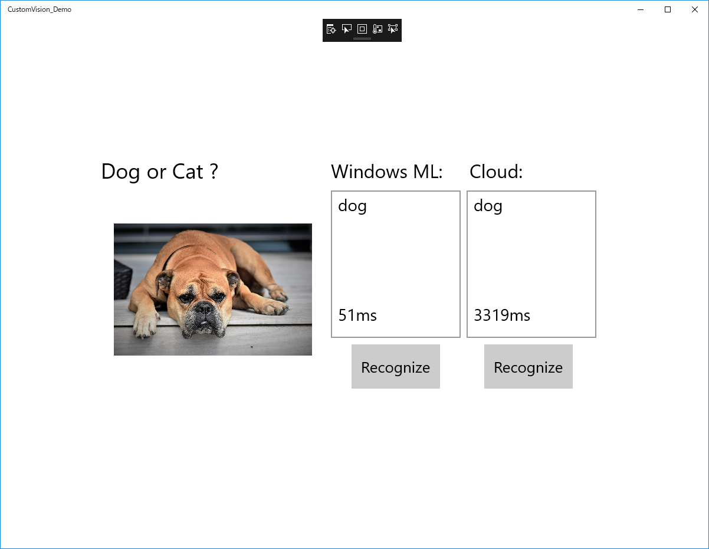

# Windows ML Demo with Custom Vision Service

This repo contains the Windows Machine Learning (Windows ML) UWP sample which utilize onnx models exported from [Custom Vision Service](https://azure.microsoft.com/ja-jp/services/cognitive-services/custom-vision-service/). Optionally you can compare results between Windows ML and API endpoint of Custom Vision Service.

# Requirements 

* [Windows 10 April 2018 Update](https://support.microsoft.com/en-us/help/4028685/windows-10-get-the-update)
* [Windows 10 SDK for Windows 10, version 1803](https://developer.microsoft.com/en-us/windows/downloads/windows-10-sdk)
* [Visual Studio 2017 version 15.7 or above](https://www.visualstudio.com/)

# How to Run sample
1. Open solution file with Visual Studio 2017
2. (Optional) Open APIInfo.cs and set your Custom Vision projectId, iterationId and predictionKey
3. Build and run app
4. Click Recognize button and select image to be inferanced
* You can use images of cats and dogs in Image folder

# Using Custom Vision Service for Training
You need to select (compact) domain to export models as ONNX when you create a new project in Custom Vision Service. For more information, [How to build a classifier with Custom Vision](https://docs.microsoft.com/ja-jp/azure/cognitive-services/custom-vision-service/getting-started-build-a-classifier).